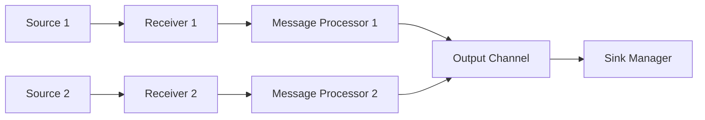

<!--
---
title: Message receivers
description: Message receivers for ClusterCockpit
categories: [cc-lib]
tags: ['Admin', 'Developer']
weight: 2
hugo_path: docs/reference/cc-lib/receivers/_index.md
---
-->

# CCMetric receivers

The `receivers` package provides a modular system for collecting metrics, events, and logs from various sources. It defines a common `Receiver` interface and a `ReceiveManager` to orchestrate multiple receiver instances.

## Architecture Overview

Receivers are the entry points for data into the ClusterCockpit monitoring stack. They collect or receive data from external sources, convert it into the internal `CCMessage` format, and send it to a unified sink channel.

### Component Roles

- **Receiver**: A component that gathers metrics from a specific source (e.g., HTTP POSTs, NATS subscriptions, or direct hardware queries like IPMI).
- **ReceiveManager**: Orchestrates the lifecycle of all configured receivers. It initializes, starts, and stops them, and ensures they all point to the correct output channel.
- **Message Processor**: An optional component within each receiver that can filter, rename, or transform messages before they are sent to the sink.

### Message Flow

1.  **Ingress**: Data arrives at the receiver (e.g., an HTTP request or a scheduled sensor read).
2.  **Decoding**: The raw data is decoded into one or more `CCMessage` objects.
3.  **Processing (Optional)**: If `process_messages` is configured, the messages pass through a processing pipeline.
4.  **Egress**: The processed messages are sent to the receiver's sink channel.
5.  **Aggregation**: All receivers send their messages to the same output channel managed by the `ReceiveManager`, which typically leads to the `SinkManager`.



## Configuration

The `ReceiveManager` is configured with a JSON object where each key is a unique name for a receiver instance, and the value is its configuration.

### Common Configuration Options

Every receiver supports these common fields:

- `type`: (Required) The type of receiver to initialize (e.g., "http", "nats").
- `process_messages`: (Optional) A list of message processing rules. See the [messageProcessor](../messageProcessor/README.md) documentation for details.

Example:

```json
{
  "my_http_receiver" : {
    "type": "http",
    "port": "8080",
    "process_messages": [
      { "add_meta": { "source": "frontend-http" } }
    ]
  },
  "my_nats_receiver": {
    "type": "nats",
    "address": "nats.example.com",
    "subject": "metrics"
  }
}
```

## The Receiver Interface

All receivers must implement the `Receiver` interface defined in `metricReceiver.go`:

```go
type Receiver interface {
    Start()                         // Start begins the metric collection process
    Close()                         // Close stops the receiver and releases resources
    Name() string                   // Name returns the receiver's identifier
    SetSink(sink chan lp.CCMessage) // SetSink configures the output channel for collected metrics
}
```

- **`Start()`**: This method is called to begin operation. For server-like receivers (e.g., HTTP), it starts the listener. For polling receivers (e.g., IPMI), it starts the collection loop. It should typically be non-blocking or start its own goroutines.
- **`Close()`**: Gracefully shuts down the receiver, closing network connections, stopping goroutines, and releasing resources.
- **`Name()`**: Returns a human-readable name for the receiver instance, usually including its type and the name from the configuration.
- **`SetSink()`**: Receives the channel where all collected `CCMessage` objects should be sent.

## Available Receivers

| Type | Description | Platform |
| :--- | :--- | :--- |
| [`http`](./httpReceiver.md) | Receives InfluxDB line protocol via HTTP POST requests. | All |
| [`nats`](./natsReceiver.md) | Subscribes to NATS subjects to receive metrics. | All |
| [`prometheus`](./prometheusReceiver.md) | Scrapes metrics from Prometheus-compatible endpoints. | All |
| [`eecpt`](./eecptReceiver.md) | Specialized HTTP receiver for EECPT instrumentation. | All |
| [`ipmi`](./ipmiReceiver.md) | Polls hardware metrics via IPMI (requires `freeipmi`). | Linux |
| [`redfish`](./redfishReceiver.md) | Polls hardware metrics via the Redfish API. | Linux |

## Utilities

### InfluxDB Decoding

The `influxDecoder.go` provides a helper function `DecodeInfluxMessage` to simplify parsing InfluxDB line protocol data into `CCMessage` objects. This is used by most receivers that accept line protocol data.

```go
import "github.com/ClusterCockpit/cc-lib/v2/receivers"
// ...
msg, err := receivers.DecodeInfluxMessage(decoder)
```

## Contributing Own Receivers

To add a new receiver type:

1.  **Define Configuration**: Create a struct for your receiver's configuration, embedding `defaultReceiverConfig`.
2.  **Implement the Interface**: Create a struct that implements `Receiver`. Use the `receiver` base struct from `metricReceiver.go` to gain default implementations of `Name()` and `SetSink()`.
3.  **Implement Factory Function**: Create a `New<Type>Receiver(name string, config json.RawMessage)` function.
4.  **Register Receiver**: Add your factory function to `AvailableReceivers` in `availableReceivers.go` (or `availableReceiversLinux.go` for Linux-only receivers).
5.  **Documentation**: Create a `<type>Receiver.md` file and update this README.

Refer to `sampleReceiver.go` for a complete, documented template.

### Best Practices

- **Goroutine Management**: Always ensure goroutines started in `Start()` are cleaned up in `Close()`. Use `sync.WaitGroup` and stop channels.
- **Error Handling**: Use the `ccLogger` package to log errors and debug information.
- **Message Processing**: Always initialize and use a `messageProcessor` in your receiver to support the `process_messages` config option.
- **Testing**: Provide a `_test.go` file. Use the `ccMessage` package to verify the messages produced by your receiver.

## Troubleshooting

- **Receiver won't start**: Check the logs for "ReceiveManager: SKIP" messages. This usually indicates a configuration error (e.g., missing `type` field or unknown receiver type).
- **No data received**:
    - Verify the network connectivity and address/port configuration.
    - Check if basic authentication is required and configured correctly.
    - If using `process_messages`, verify that rules are not accidentally dropping all messages.
- **IPMI/Redfish issues**: Ensure the required external tools (like `freeipmi`) are installed and that the user running the collector has the necessary permissions.

## Testing Guidelines

Each receiver should have unit tests that:
1.  Initialize the receiver with a valid configuration.
2.  Simulate ingress data (e.g., sending a mock HTTP request or providing mock command output).
3.  Verify that the correct `CCMessage` objects are sent to the sink channel.
4.  Verify that `Close()` successfully stops all background activities.
